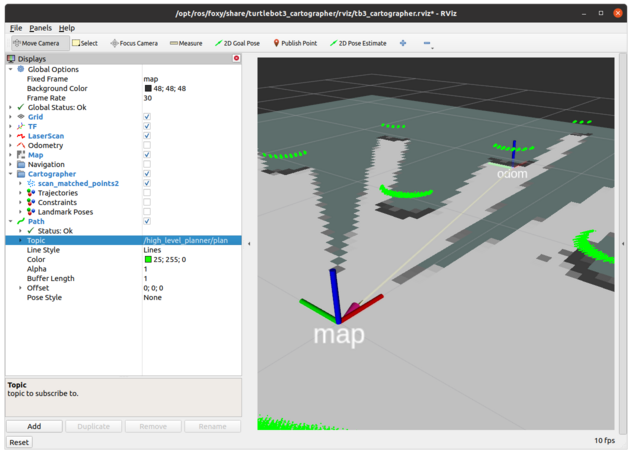

Flex Nav Turtlebot2 Demo
================================

## Introduction

Custom behaviors and launch files for demonstrations of the [ROS 2] and [FlexBE]-based [Flexible Navigation] ([Wiki])
for use with the Kobuki-based Turtlebot 2 system.

This repository contains code that interfaces with the ROS 2 versions of the
[Kobuki Turtlebot2] models, the [FlexBE Behavior Engine],
[FlexBE App], and the [Flexible Navigation] system.

 > NOTE:  As of 18-Oct-22 with the ROS Humble release an issue with the Navigation 2 costmap causes issue with
 > default DDS implementation Fast DDS (ros-humble-rmw-fastrtps-cpp).  
 > Switching to `export RMW_IMPLEMENTATION=rmw_cyclonedds_cpp` seems to fix issue.
 > Track https://github.com/ros-planning/navigation2/issues/3014 , 3018, and 2489 for more information.

Installation and Setup
----------------------

This package has a number of dependencies.  

For CNU Robotics work, we typically use [CHRISLab Install] scripts to handle workspace
setup, install, and build.  The below repos are including in the install scripts there.

Quickly skim this README before installing or running anything:

This demonstration makes use of the following repositories:

<pre>
- git: {local-name: src/flexbe_app,               uri: 'https://github.com/FlexBE/flexbe_app.git',                    version: ros2-devel }
- git: {local-name: src/flexbe_behavior_engine,   uri: 'https://github.com/FlexBE/flexbe_behavior_engine.git',        version: ros2-devel }
- git: {local-name: src/flexible_navigation,      uri: 'https://github.com/FlexBE/flexible_navigation.git',           version: ros2-devel }
- git: {local-name: src/flex_nav_turtlebot2_demo, uri: 'https://github.com/CNURobotics/flex_nav_turtlebot2_demo.git', version: ros2-devel }
- git: {local-name: src/ball_detector,            uri: 'https://github.com/CNURobotics/ball_detector.git',            version: ros2-devel }
- git: {local-name: src/chris_ros_turtlebot2,     uri: 'https://github.com/CNURobotics/chris_ros_turtlebot2.git',     version: ros2-devel }
- git: {local-name: src/chris_world_models,       uri: 'https://github.com/CNURobotics/chris_world_models.git',       version: ros2-devel }
- git: {local-name: src/image_pipeline,           uri: 'https://github.com/CNURobotics/image_pipeline.git',           version: humble-image-flip }
- git: {local-name: src/openni2_camera,           uri: 'https://github.com/CNURobotics/openni2_camera.git',           version: astra-humble }
</pre>

At this current stage, some Kobuki Turtlebot2 related packages are not released in ROS2 binary form, so we are using the following for source builds:
<pre>
- git: {local-name: src/sophus,                   uri: 'https://github.com/stonier/sophus.git',                            version: release/1.2.x }
- git: {local-name: src/ecl_tools,                uri: 'https://github.com/stonier/ecl_tools.git',                         version: devel }
- git: {local-name: src/ecl_lite,                 uri: 'https://github.com/stonier/ecl_lite.git',                          version: devel }
- git: {local-name: src/ecl_core.git,             uri: 'https://github.com/stonier/ecl_core.git',                          version: devel }
- git: {local-name: src/kobuki_ros,               uri: 'https://github.com/CNURobotics/kobuki_ros.git',                    version: humble-test }
- git: {local-name: src/kobuki_core,              uri: 'https://github.com/kobuki-base/kobuki_core.git',                   version: devel }
- git: {local-name: src/kobuki_ros_interfaces,    uri: 'https://github.com/kobuki-base/kobuki_ros_interfaces.git',         version: devel }
</pre>

Install in the `src` folder of your WORKSPACE_ROOT, and from the

<pre>
colcon build
. setup.bash
</pre>

> NOTE: Anytime you build new packages, you need to re-run the setup.bash script inside the workspace root.  
> Anytime you change a Python script or launch file, you need to re-run `colcon build` from the WORKSPACE_ROOT folder, but you only need to re-source `. setup.bash` when the package information and folders change.

On a new build, you must install the Java Script package that the FlexBE app will require:
<pre>
ros2 run flexbe_app nwjs_install
</pre>

> Note: With colcon, this will need to be re-run anytime the `install` folder is deleted as it is installed relative to the `flexbe_app` package.

## Operation
---------

A number of start up scripts are provided in `flex_nav_turtlebot2_bringup`

### For hardware demonstration:

<pre>
export USE_SIM_TIME=False
ros2 run flex_nav_turtlebot2_bringup hw-tmux
ros2 run flex_nav_turtlebot2_bringup onboard-tmux
</pre>

And on OCS computer,

<pre>
ros2 run flex_nav_turtlebot2_bringup ocs-tmux
</pre>

For onboard hw, the `tmux` is preferred.
For OCS, either `ocs-tmux` or `launch-ocs` bash script is available.

### For basic simulation demonstration:

<pre>
export USE_SIM_TIME=True
ros2 run flex_nav_turtlebot2_bringup launch-sim  
ros2 run flex_nav_turtlebot2_bringup launch-onboard
ros2 run flex_nav_turtlebot2_bringup launch-ocs  
</pre>

These may be started up on a single computer, or multiple computers if using networked simulation.

There are also associated `tmux` versions for simulation if preferred.

>NOTE: With both `tmux` and `launch` scripts, the terminal will close if the started
> nodes completely shutdown. Manually starting each script may be warranted for debugging.

### Manual start up of simulation demonstration:

To launch in separate terminals, use these commands in each terminal:

<pre>
# Simulation
ros2 launch chris_world_models ${WORLD_MODEL:=gazebo_creech_world}.launch.py use_sim_time:=True
ros2 launch chris_ros_turtlebot2 turtlebot_gazebo.launch.py use_sim_time:=True

# Onboard
# To use other (e.g. amcl or cartographer, set LOCALIZATION environment variable (e.g. export LOCALIZATION=amcl)
ros2 launch flex_nav_turtlebot2_bringup "${LOCALIZATION:=slam}.launch.py" use_sim_time:=True
ros2 launch flex_nav_turtlebot2_bringup ${FLEX_NAV_SETUP:=fake}.launch.py use_sim_time:=True
ros2 launch flexbe_onboard behavior_onboard.launch.py use_sim_time:=True

# Operator Control Station (OCS)
ros2 launch flex_nav_turtlebot2_bringup rviz.launch.py use_sim_time:=True
ros2 run flexbe_mirror behavior_mirror_sm --ros-args --remap name:="behavior_mirror"
ros2 run flexbe_widget be_launcher --ros-args --remap name:="behavior_launcher"
ros2 run flexbe_app run_app --ros-args --remap name:="flexbe_app" use_sim_time:=True

# Optional depending on selected behavior 
ros2 launch flex_nav_turtlebot2_bringup paths_by_name.launch.py use_sim_time:=True
ros2 launch simple_ball_detector ball_detector.launch.py use_sim_time:=True
</pre>

>  Currently. the `FLEX_NAV_SETUP` only works with `flex` as described above.  
> Drop the `.py` from `launch.py` if using 

<pre>
ros2 launch flex_nav_turtlebot2_bringup flex_multi_level.launch use_sim_time:=True
</pre>

or 

<pre>
ros2 launch flex_nav_turtlebot2_bringup flex_four__level.launch use_sim_time:=True
</pre>

> Until we fix the launch files to new style.

----

> Note: If using `amcl` for localization, you will need to manually start the `map_server` for now.
> The map server publishes the known map that you are working with.

> e.g., `ros2 launch chris_world_models creech_map_050_server.launch.py`

> Do this before starting `amcl` localization, which will activate the map server lifecycle by default.

-----

All of these scripts also make use of the following environment variables:
<pre>
export WORLD_MODEL=
export LOCALIZATION=fake # (e.g. fake, slam, amcl, or cartographer)
export USE_SIM_TIME=true # (or false as appropriate)
export FLEX_NAV_SETUP=flex # (or flex_multi_level)
export WORLD_MODEL=gazebo_creech_world #( if not set by launch, see the `chris_world_models` package for more world model setups.)
</pre>

By default we are using the `fake` localization provided by `chris_ros_turtlebot2` for testing.

Typically the `setup.bash` is created by the setup script created during our standard
install process [CHRISLab Install] .

The following directions are for a simple demonstration of Flexible Navigation

### Optional: Drop some balls at random locations in simulation

The "Detector" behaviors look for balls in the scene.  
To add some to simulation at random locations use:

 * `ros2 launch chris_world_models creech_random_balls.launch.py`

 The launch file specifies 8 blue, 2 red, and 4 green balls dropped randomly in Creech world.

 You can edit the launch file to change quantities, or use the `add_balls.launch.py` and edit the `param/balls.csv` file
 if you want to start with specified locations.

### Visualization

  Displays a standard view of transforms of Turtlebot2, sensor data, with maps, and paths displayed

  > NOTE: This is typically started by the `launch-ocs` script described above.

  * `ros2 launch flex_nav_turtlebot2_bringup rviz.launch.py`

     This custom version adds the robot model, path, and global cost map to the default cartographer setup.

    * A `Path` to the RViz display and set the topic to `/high_level_planner/plan`
    * A `RobotModel` (uses the `/robot_description` topic)
    * A `Map` showing the topic `/global_costmap/costmap`
    * The `2D Goal Pose` publishes to the topic `/flex_nav_global/goal`

You may want to add a `Camera` pointing to the `/ball_detector/image` to see the marked balls.
These are relatively small and may not be that useful.

To see full size, it might be better to periodically run:

  * `ros2 run image_view image_saver --ros-args --remap image:=/ball_detector/image` or
  * `ros2 run image_view image_view --ros-args --remap image:=/ball_detector/image`  

  You can also add a `MarkerArray` with the topic `/ball_detector/ball_markers`.

In the topic, you will need to set the Reliability to "Best Effort" for the topics to be received.
  * ROS 2 defaults to publishing sensor data as "Best Effort" to save band width for large data systems.

###

### Startup of Flexible Navigation

> NOTE: These are normally started by the `hw-tmux`, or `launch-onboard` scripts described above.
> Our scripts allow making the selection via the `FLEX_NAV_SETUP` environment variable described above,
> or you can manually start using:

Then start one (and only one) of the following:

 `ros2 launch flex_nav_turtlebot2_bringup flex.launch.py`
 * This starts the planning and control nodes.
 * This version uses a 2-level planner as a demonstration.
  * The global planner plans over the full map, with sensor data
  * The local planner plans over smaller window trying to follow the global path

or

`ros2 launch flex_nav_turtlebot2_bringup flex_multi_level.launch`  *Not `.py` for now
 * This starts the planning and control nodes.
 * This version uses a 3-level planner as a demonstration.
  * The high-level planner is based only on the static map
  * The mid-level planner using only local obstacle sensing
  * The low-level planner using the [ROS 2 Navigation2] DWBLocalPlanner

 *  The mid- and low-level planners run concurrently as they try to follow the global path defined by the high-level planner.

 Flexible Navigation requires startup of planning and control nodes, as well as the FlexBE behavior engine and UI.

### FlexBE Operation
After OCS startup, all control is through the FlexBE App operator interface and RViz.  

> NOTE: For first run, you may need to `ros2 run flexbe_app nwjs_install` for new install build

* First load the desired behavior through the `FlexBE Behavior Dashboard` tab.
  * The behavior should match the flex launch started above.
    * `flex.launch` --> `Turtlebot2 Flex Planner`
    * `flex_multi_level.launch` --> `Turtlebot2 Multi Level Flex Planner`

* Examine (but don't modify yet!) the behavior using the `Statemachine Editor` button on FlexBE app
  * Click on a state to see the configurable parameters

* Execute the behavior via the `FlexBE Runtime Control` tab.
  * Click `Connect` to establish the initial connection between App and Behavior Engine
  * Then `Start Execution`

* The system requires the operator to input a `2D Nav Goal` via the `RViz` screen
  * If the system is in `low` autonomy or higher, the system will request a global plan as soon as the goal is received
  * If the autonomy level is `off` (default), then the operator will need to confirm receipt by clicking the `done` transition.

* After requesting a path to the goal, the resulting plan will be visualized in the `RViz` window.  
  * If the system is not in full autonomy mode, the operator must confirm that the system should execute the plan via the `FlexBE UI`  
  * If the operator sets the `Runtime Executive` to `full` autonomy, the plan will automatically be executed.  
  * In less than `full` autonomy, the operator can request a recovery behavior at this point.

* Once execution of this plan is complete, `FlexBE` will seek permission to continue planning
  * In `full` autonomy, the system will automatically transition to requesting a new goal
  * In any autonomy level less than `full`, the system will require an operator decision to continue

Whenever a plan is being executed, the `FlexBE` state machine transitions to a concurrent node that uses on line  planners
to refine the plans as the robot moves, and also monitors the Turtlebot bumper status for collision.  
The operator can terminate the execution early by selecting the appropriate transition in the `FlexBE UI`.  
If this low level plan fails, the robot will request permission to initiate a recovery behavior;
in `full` autonomy the system automatically initiates the recovery.

## Publications

Please use the following publications for reference when using Flexible Navigation:

- David C. Conner and Justin Willis, ["Flexible Navigation: Finite state machine-based integrated navigation and control for ROS enabled robots,"](http://dx.doi.org/10.1109/SECON.2017.7925266) SoutheastCon 2017.

- Joshua Zutell, David C. Conner and Philipp Schillinger, ["ROS 2-Based Flexible Behavior Engine for Flexible Navigation,"](http://dx.doi.org/10.1109/SoutheastCon48659.2022.9764047) SoutheastCon, 2022.

---

[ROS 2]: https://docs.ros.org/en/foxy/index.html
[FlexBE]: https://flexbe.github.io
[FlexBE App]: https://github.com/FlexBE/flexbe_app
[FlexBE Behavior Engine]: https://github.com/FlexBE/flexbe_behavior_engine
[Flexible Navigation]: https://github.com/FlexBE/flexible_navigation
[Wiki]: http://wiki.ros.org/flexible_navigation
[Kobuki Turtlebot2]: https://github.com/kobuki-base/kobuki_ros
[Kobuki ROS]: https://github.com/kobuki-base/kobuki_ros
[Koubki ROS Interfaces]: https://github.com/kobuki-base/kobuki_ros_interfaces

[ROS 2 Cartographer]: https://ros2-industrial-workshop.readthedocs.io/en/latest/_source/navigation/ROS2-Cartographer.html
[ROS 2 Installation]: https://docs.ros.org/en/foxy/Installation.html
[ROS 2 Navigation2]: https://navigation.ros.org/
[ros2_control]:https://control.ros.org/getting_started.html
[CHRISLab Install]: https://github.com/CNURobotics/chris_install
